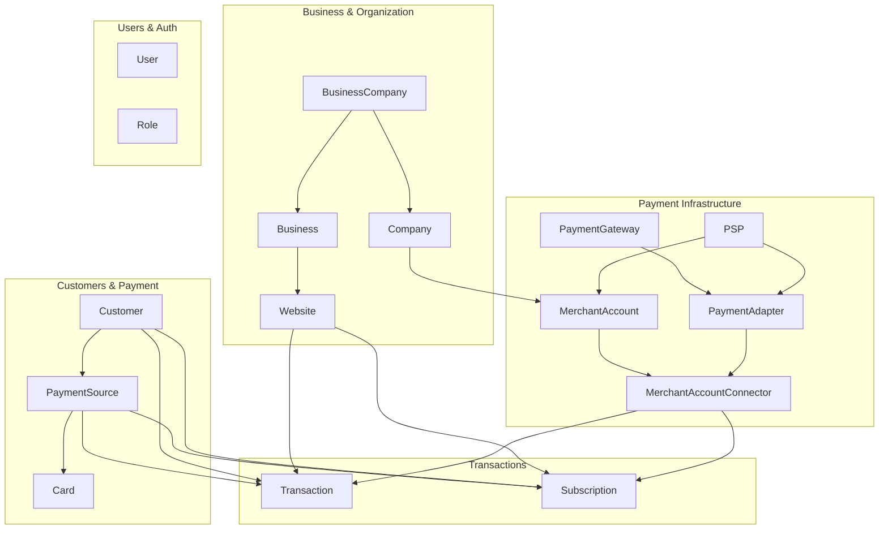
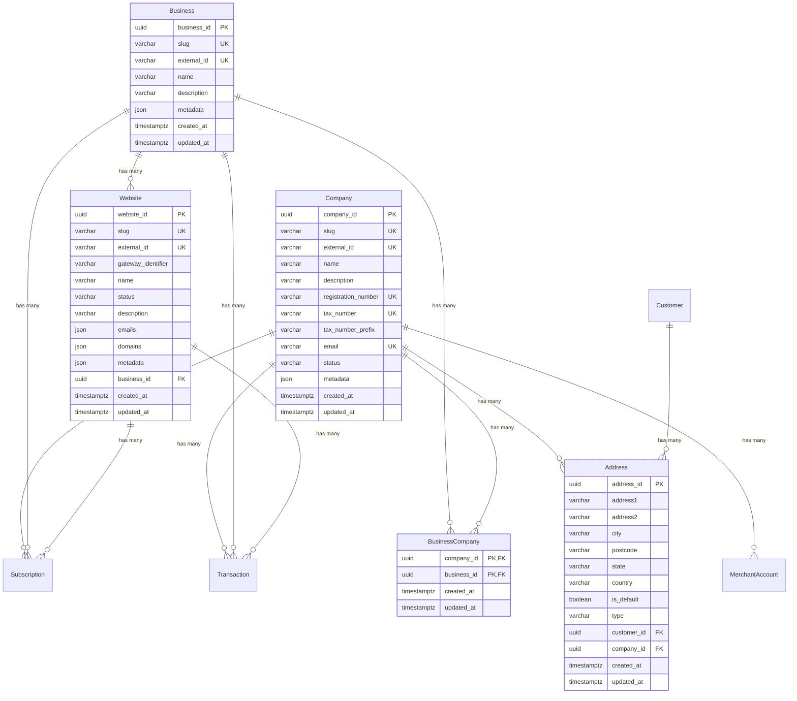
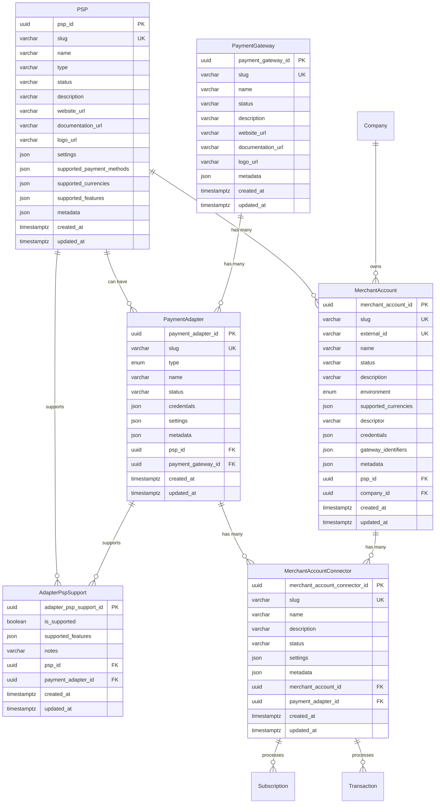
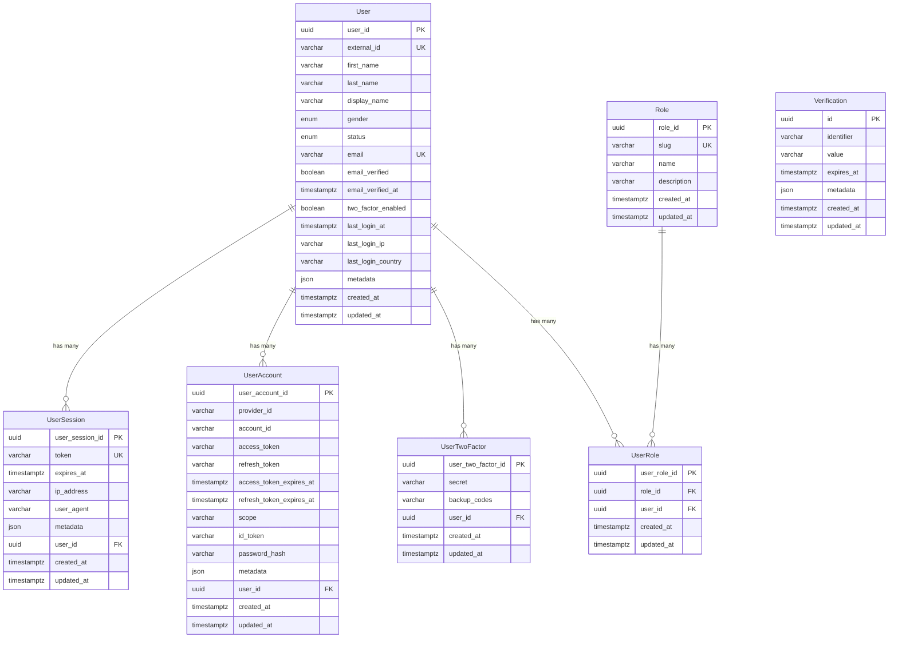
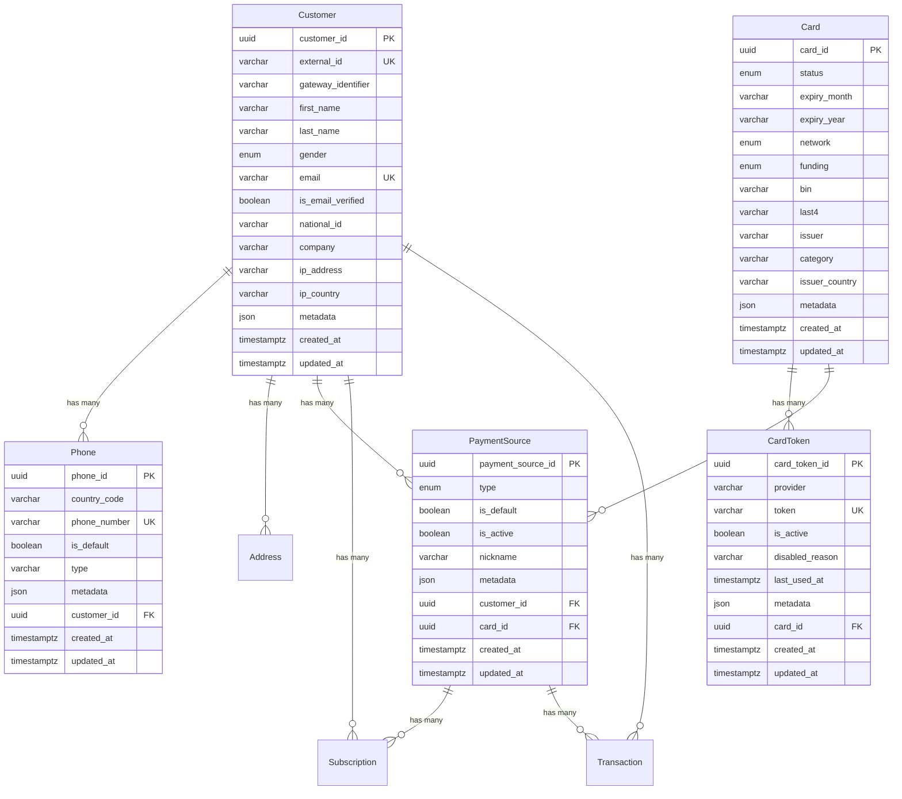
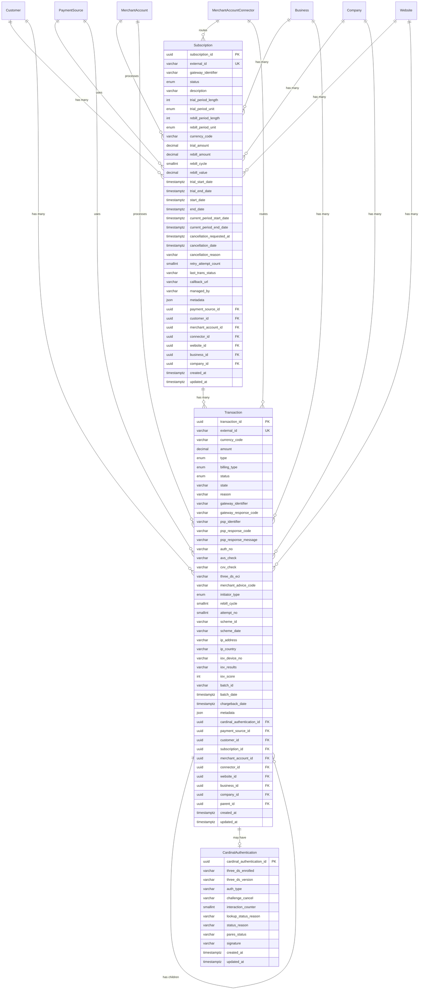

# Paynova Database Documentation

## Table of Contents

1. [Overview](#overview)
2. [Architecture](#architecture)
3. [Domain Documentation](#domain-documentation)
   - [Business & Organization Domain](#business--organization-domain)
   - [Payment Infrastructure Domain](#payment-infrastructure-domain)
   - [User Management & Authentication Domain](#user-management--authentication-domain)
   - [Customer & Payment Methods Domain](#customer--payment-methods-domain)
   - [Transaction & Subscription Domain](#transaction--subscription-domain)
4. [Table Reference](#table-reference)
5. [Enums Reference](#enums-reference)
6. [Key Relationships & Patterns](#key-relationships--patterns)
7. [Integration Guidelines](#integration-guidelines)

---

## Overview

Paynova is a comprehensive payment processing and subscription management system built on PostgreSQL. The database architecture supports:

- **Multi-tenant Business Management**: Hierarchical organization structure
- **Flexible Payment Routing**: Multiple PSPs and payment gateways
- **Secure Payment Processing**: PCI-compliant tokenization
- **Recurring Billing**: Subscription management with trial periods
- **User Authentication**: Role-based access control with 2FA
- **Transaction Management**: Complete payment lifecycle tracking

### Database Statistics

- **Total Tables**: 26
- **Total Enums**: 8
- **Database Provider**: PostgreSQL
- **ORM**: Prisma

---

## Architecture

### High-Level System Architecture



### Domain Breakdown

The database is organized into 5 main domains:

1. **Business & Organization Domain** (5 tables)

   - Manages multi-tenant business structure
   - Handles company and website relationships

2. **Payment Infrastructure Domain** (6 tables)

   - Configures PSPs and payment gateways
   - Routes payments through adapters and connectors

3. **User Management & Authentication Domain** (7 tables)

   - User authentication and authorization
   - Role-based access control with 2FA

4. **Customer & Payment Methods Domain** (5 tables)

   - Customer data management
   - Tokenized payment method storage

5. **Transaction & Subscription Domain** (3 tables)
   - Transaction processing and tracking
   - Recurring subscription management

---

## Domain Documentation

### Business & Organization Domain

This domain manages the hierarchical multi-tenant structure of the platform, allowing multiple businesses and companies to operate independently while sharing infrastructure.

#### Entity Relationship Diagram



#### Tables in this Domain

##### Business

**Purpose**: Represents a top-level business entity in the multi-tenant system. A business can have multiple websites and can be associated with multiple companies.

**Key Fields**:

- `business_id`: UUID primary key
- `slug`: Unique human-readable identifier (e.g., "acme-corp")
- `external_id`: Optional external system reference
- `name`: Business display name
- `description`: Brief description of the business
- `metadata`: Flexible JSON field for additional data

**Relationships**:

- Has many `websites`
- Has many `business_companies` (many-to-many with Company)
- Has many `subscriptions`
- Has many `transactions`

**Indexes**:

- `slug` for fast lookups

**Use Case**: When a platform hosts multiple brands or businesses, each with its own identity and websites.

---

##### Company

**Purpose**: Represents a legal entity (corporation) that processes payments. Companies own merchant accounts and can be associated with multiple businesses.

**Key Fields**:

- `company_id`: UUID primary key
- `slug`: Unique human-readable identifier
- `external_id`: Optional external system reference
- `status`: Current status (default: "ACTIVE")
- `name`: Legal company name
- `registration_number`: Unique company registration number
- `tax_number`: Unique tax identification number
- `tax_number_prefix`: Country/region prefix for tax number
- `email`: Company contact email
- `metadata`: Flexible JSON field for additional data

**Relationships**:

- Has many `addresses`
- Has many `business_companies` (many-to-many with Business)
- Has many `merchant_accounts`
- Has many `subscriptions`
- Has many `transactions`

**Indexes**:

- `slug` for fast lookups

**Unique Constraints**:

- `registration_number`, `tax_number`, `email` must be unique

**Use Case**: Legal entity that holds contracts with PSPs and processes payments on behalf of businesses.

---

##### BusinessCompany

**Purpose**: Junction table implementing many-to-many relationship between businesses and companies. Allows flexible business structures where one business can be operated by multiple companies or one company can operate multiple businesses.

**Key Fields**:

- `company_id`: Foreign key to Company (part of composite PK)
- `business_id`: Foreign key to Business (part of composite PK)
- `created_at`: Timestamp of association
- `updated_at`: Last update timestamp

**Relationships**:

- Belongs to `company`
- Belongs to `business`

**Use Case**: When a parent company operates multiple subsidiary brands, or when multiple companies jointly operate a business.

---

##### Website

**Purpose**: Represents a customer-facing website or application that processes payments. Each website belongs to one business and can have multiple subscriptions and transactions.

**Key Fields**:

- `website_id`: UUID primary key
- `slug`: Unique human-readable identifier
- `external_id`: Optional external system reference
- `gateway_identifier`: Identifier used by payment gateways
- `name`: Website display name
- `status`: Current status (default: "ACTIVE")
- `description`: Website description
- `emails`: JSON array of contact emails
- `domains`: JSON array of associated domains
- `business_id`: Foreign key to Business
- `metadata`: Flexible JSON field for additional data

**Relationships**:

- Belongs to `business`
- Has many `subscriptions`
- Has many `transactions`

**Indexes**:

- `business_id` for filtering by business
- `slug` for fast lookups

**Use Case**: Individual storefronts, mobile apps, or web applications that need separate payment tracking under the same business.

---

##### Address

**Purpose**: Stores physical addresses for both companies (business addresses) and customers (billing/shipping addresses). Supports multiple address types per entity.

**Key Fields**:

- `address_id`: UUID primary key
- `address1`: Primary address line
- `address2`: Secondary address line (suite, apt, etc.)
- `city`: City name
- `postcode`: Postal/ZIP code
- `state`: State/province/region
- `country`: ISO 3166-1 alpha-2 country code (2 characters)
- `is_default`: Whether this is the default address
- `type`: Address type (e.g., "home", "billing", "shipping")
- `customer_id`: Foreign key to Customer (nullable)
- `company_id`: Foreign key to Company (nullable)

**Relationships**:

- Belongs to `customer` (optional)
- Belongs to `company` (optional)

**Unique Constraints**:

- `[company_id, type]`: Each company can have only one address per type

**Indexes**:

- `customer_id` for customer address lookups
- `company_id` for company address lookups

**Use Case**: Stores billing and shipping addresses for customers, and business addresses for companies.

---

### Payment Infrastructure Domain

This domain configures the payment processing infrastructure, managing connections to multiple Payment Service Providers (PSPs) and payment gateways through a flexible adapter pattern.

#### Entity Relationship Diagram



#### Tables in this Domain

##### PSP (Payment Service Provider)

**Purpose**: Represents a payment service provider (e.g., Stripe, Checkout.com, PayPal) that can process payments. PSPs have specific capabilities, supported currencies, and payment methods.

**Key Fields**:

- `psp_id`: UUID primary key
- `slug`: Unique human-readable identifier (e.g., "stripe", "checkout")
- `name`: Display name of the PSP
- `type`: PSP type classification
- `status`: Current status (default: "ACTIVE")
- `description`: Brief description of the PSP
- `website_url`: PSP's website URL
- `documentation_url`: Link to PSP's documentation
- `logo_url`: Path to PSP logo image
- `settings`: JSON configuration specific to this PSP
- `supported_payment_methods`: JSON array of payment methods (e.g., ["card", "apple_pay"])
- `supported_currencies`: JSON array of currency codes (e.g., ["USD", "EUR", "GBP"])
- `supported_features`: JSON object describing PSP capabilities (e.g., {"3ds": true, "recurring": true})
- `metadata`: Flexible JSON field for additional data

**Relationships**:

- Has many `merchant_accounts`
- Has many `payment_adapters` (for direct PSP integration)
- Has many `adapter_psp_support` (for gateway-routed PSPs)

**Indexes**:

- `slug` for fast lookups

**Use Case**: Central registry of all PSPs available in the system, with their capabilities and configuration.

---

##### PaymentGateway

**Purpose**: Represents payment gateways (e.g., IxoPay) that act as intermediaries, routing payments to multiple PSPs through a single integration point.

**Key Fields**:

- `payment_gateway_id`: UUID primary key
- `slug`: Unique human-readable identifier
- `name`: Display name of the gateway
- `status`: Current status (default: "ACTIVE")
- `description`: Brief description
- `website_url`: Gateway's website URL
- `documentation_url`: Link to documentation
- `logo_url`: Path to gateway logo
- `metadata`: Flexible JSON field for additional data

**Relationships**:

- Has many `payment_adapters`

**Indexes**:

- `slug` for fast lookups

**Use Case**: When using a gateway like IxoPay that can route to multiple PSPs, reducing the number of direct integrations needed.

---

##### PaymentAdapter

**Purpose**: Represents the integration code/adapter that connects to either a PSP directly or a payment gateway. This is the actual implementation that makes API calls.

**Key Fields**:

- `payment_adapter_id`: UUID primary key
- `slug`: Unique human-readable identifier (e.g., "checkout-adapter", "ixopay-gateway")
- `type`: Enum - `DIRECT_PSP` or `GATEWAY`
- `name`: Display name
- `status`: Current status (default: "ACTIVE")
- `credentials`: JSON with API credentials (encrypted/sensitive)
- `settings`: JSON configuration for this adapter
- `psp_id`: Foreign key to PSP (for DIRECT_PSP type)
- `payment_gateway_id`: Foreign key to PaymentGateway (for GATEWAY type)
- `metadata`: Flexible JSON field for additional data

**Relationships**:

- Belongs to `psp` (when type is DIRECT_PSP)
- Belongs to `payment_gateway` (when type is GATEWAY)
- Has many `adapter_psp_support` (for gateways supporting multiple PSPs)
- Has many `merchant_account_connectors`

**Indexes**:

- `psp_id` for filtering by PSP
- `payment_gateway_id` for filtering by gateway
- `slug` for fast lookups

**Unique Constraints**:

- `[merchant_account_id, payment_adapter_id]` in connectors ensures no duplicate connections

**Use Case**: The adapter pattern allows the system to support multiple payment integrations with a unified interface.

**Example**:

- Direct PSP: A Stripe adapter with type=DIRECT_PSP, psp_id pointing to Stripe
- Gateway: An IxoPay adapter with type=GATEWAY, payment_gateway_id pointing to IxoPay

---

##### AdapterPspSupport

**Purpose**: Junction table that tracks which PSPs are supported by which payment adapters (primarily for gateway adapters that can route to multiple PSPs). Stores PSP-specific features and capabilities through the gateway.

**Key Fields**:

- `adapter_psp_support_id`: UUID primary key
- `is_supported`: Boolean indicating if this PSP is currently supported
- `supported_features`: JSON describing which features work (e.g., {"3ds": true, "refunds": true})
- `notes`: Optional notes about limitations or requirements
- `psp_id`: Foreign key to PSP
- `payment_adapter_id`: Foreign key to PaymentAdapter

**Relationships**:

- Belongs to `psp`
- Belongs to `payment_adapter`

**Unique Constraints**:

- `[psp_id, payment_adapter_id]`: Each PSP can only be listed once per adapter

**Use Case**: When using IxoPay gateway, track which PSPs (Stripe, Checkout.com, etc.) are available through it and what features each supports.

---

##### MerchantAccount

**Purpose**: Represents a company's account with a specific PSP. Contains credentials and configuration needed to process payments through that PSP.

**Key Fields**:

- `merchant_account_id`: UUID primary key
- `slug`: Unique human-readable identifier
- `external_id`: Optional external system reference
- `name`: Display name for this account
- `status`: Current status (default: "ACTIVE")
- `description`: Brief description
- `environment`: Enum - `SANDBOX` or `PRODUCTION`
- `supported_currencies`: JSON array of currencies this account can process
- `descriptor`: Statement descriptor shown on customer's card statement
- `credentials`: JSON with PSP-specific credentials (encrypted/sensitive)
- `gateway_identifiers`: JSON with gateway-specific IDs (e.g., connector IDs)
- `psp_id`: Foreign key to PSP
- `company_id`: Foreign key to Company
- `metadata`: Flexible JSON field for additional data

**Relationships**:

- Belongs to `psp`
- Belongs to `company`
- Has many `merchant_account_connectors`
- Has many `subscriptions`
- Has many `transactions`

**Indexes**:

- `psp_id` for filtering by PSP
- `company_id` for filtering by company
- `slug` for fast lookups

**Use Case**: A company may have multiple merchant accounts with the same PSP (e.g., one for each currency or brand) or accounts with different PSPs for redundancy.

---

##### MerchantAccountConnector

**Purpose**: Connects a merchant account to a payment adapter with specific configuration. This is the actual routing configuration that determines how payments are processed.

**Key Fields**:

- `merchant_account_connector_id`: UUID primary key
- `slug`: Unique human-readable identifier
- `name`: Display name for this connector
- `description`: Brief description
- `status`: Current status (default: "ACTIVE")
- `settings`: JSON configuration for routing rules, retry logic, etc.
- `merchant_account_id`: Foreign key to MerchantAccount
- `payment_adapter_id`: Foreign key to PaymentAdapter
- `metadata`: Flexible JSON field for additional data

**Relationships**:

- Belongs to `merchant_account`
- Belongs to `payment_adapter`
- Has many `subscriptions`
- Has many `transactions`

**Unique Constraints**:

- `[merchant_account_id, payment_adapter_id]`: Each merchant account can only connect to an adapter once

**Indexes**:

- `merchant_account_id` for filtering by merchant account
- `payment_adapter_id` for filtering by adapter
- `slug` for fast lookups

**Use Case**: The final routing configuration that says "Use this merchant account with this adapter to process payments". Multiple connectors can be active, enabling smart routing, fallback, and load balancing.

**Example Flow**:

1. Transaction comes in for Company A, Website X
2. System looks up active connectors for Company A
3. Finds connector linking MerchantAccount (Company A's Stripe account) → PaymentAdapter (Stripe direct adapter)
4. Uses that connector to process the payment

---

### User Management & Authentication Domain

This domain handles user authentication, authorization, session management, and two-factor authentication for the backoffice and administrative interfaces.

#### Entity Relationship Diagram



#### Tables in this Domain

##### User

**Purpose**: Represents administrative users who access the backoffice system. Supports multiple authentication methods and mandatory two-factor authentication.

**Key Fields**:

- `user_id`: UUID primary key
- `external_id`: Optional external system reference
- `first_name`: User's first name
- `last_name`: User's last name
- `display_name`: Display name for UI
- `gender`: Enum - `M` or `F` (optional)
- `status`: Enum - `ACTIVE`, `INACTIVE`, or `CLOSED` (default: ACTIVE)
- `email`: Unique email address
- `email_verified`: Boolean indicating if email is verified
- `email_verified_at`: Timestamp of email verification
- `two_factor_enabled`: Boolean indicating 2FA status (default: true)
- `last_login_at`: Timestamp of last login
- `last_login_ip`: IP address of last login
- `last_login_country`: ISO country code of last login
- `metadata`: Flexible JSON field for additional data

**Relationships**:

- Has many `user_sessions`
- Has many `user_accounts` (for different auth providers)
- Has many `user_two_factors`
- Has many `user_roles`

**Indexes**:

- `external_id` for external system lookups

**Unique Constraints**:

- `email` must be unique

**Use Case**: Administrative users, support staff, and developers who need access to the backoffice system.

---

##### UserSession

**Purpose**: Tracks active user sessions for authentication and security. Each login creates a new session with an expiration time.

**Key Fields**:

- `user_session_id`: UUID primary key
- `token`: Unique session token (used in cookies/headers)
- `expires_at`: Session expiration timestamp
- `ip_address`: IP address of session creation
- `user_agent`: Browser/client user agent string
- `user_id`: Foreign key to User
- `metadata`: Flexible JSON field for additional data

**Relationships**:

- Belongs to `user` (with CASCADE delete)

**Indexes**:

- `user_id` for filtering user sessions

**Unique Constraints**:

- `token` must be unique

**Delete Behavior**:

- When user is deleted, all sessions are automatically deleted (CASCADE)

**Use Case**: Session management, logout, security monitoring, and concurrent session detection.

---

##### UserAccount

**Purpose**: Stores authentication provider-specific data for users. Supports multiple authentication methods (password, OAuth, etc.) per user.

**Key Fields**:

- `user_account_id`: UUID primary key
- `provider_id`: Authentication provider identifier (e.g., "credentials", "google", "github")
- `account_id`: User's ID with the external provider
- `access_token`: OAuth access token (if applicable)
- `refresh_token`: OAuth refresh token (if applicable)
- `access_token_expires_at`: Access token expiration
- `refresh_token_expires_at`: Refresh token expiration
- `scope`: OAuth scopes granted
- `id_token`: OpenID Connect ID token
- `password_hash`: Hashed password (for credentials provider)
- `user_id`: Foreign key to User
- `metadata`: Flexible JSON field for additional data

**Relationships**:

- Belongs to `user` (with CASCADE delete)

**Indexes**:

- `user_id` for filtering user accounts

**Delete Behavior**:

- When user is deleted, all auth accounts are automatically deleted (CASCADE)

**Use Case**: Support multiple authentication methods per user, enable social login, password-based auth, and token refresh.

---

##### UserTwoFactor

**Purpose**: Stores two-factor authentication secrets and backup codes for users who have 2FA enabled.

**Key Fields**:

- `user_two_factor_id`: UUID primary key
- `secret`: TOTP secret key (encrypted)
- `backup_codes`: Comma-separated backup codes (encrypted)
- `user_id`: Foreign key to User

**Relationships**:

- Belongs to `user` (with CASCADE delete)

**Indexes**:

- `user_id` for filtering

**Delete Behavior**:

- When user is deleted, 2FA data is automatically deleted (CASCADE)

**Use Case**: TOTP-based 2FA (Google Authenticator, Authy, etc.) with emergency backup codes.

---

##### UserRole

**Purpose**: Junction table implementing many-to-many relationship between users and roles for role-based access control (RBAC).

**Key Fields**:

- `user_role_id`: UUID primary key
- `role_id`: Foreign key to Role
- `user_id`: Foreign key to User

**Relationships**:

- Belongs to `role`
- Belongs to `user` (with CASCADE delete)

**Indexes**:

- `role_id` for filtering by role
- `user_id` for filtering by user

**Delete Behavior**:

- When user is deleted, role assignments are automatically deleted (CASCADE)

**Use Case**: Assign multiple roles to users for flexible permission management.

---

##### Role

**Purpose**: Defines roles with associated permissions for RBAC. Roles can be assigned to multiple users.

**Key Fields**:

- `role_id`: UUID primary key
- `slug`: Unique human-readable identifier (e.g., "admin", "support", "developer")
- `name`: Display name for the role
- `description`: Description of role's purpose and permissions

**Relationships**:

- Has many `user_roles`

**Indexes**:

- `slug` for fast lookups

**Unique Constraints**:

- `slug` must be unique

**Use Case**: Define roles like "admin", "finance", "support", "read-only" with specific permissions checked in application code.

---

##### Verification

**Purpose**: Stores temporary verification codes for email verification, password resets, and other verification workflows.

**Key Fields**:

- `id`: UUID primary key
- `identifier`: The identifier being verified (e.g., email address)
- `value`: The verification code or token
- `expires_at`: Expiration timestamp
- `metadata`: Flexible JSON field for additional data (e.g., verification type, attempts)

**Indexes**:

- `identifier` for fast lookups

**Use Case**: Email verification links, password reset tokens, magic link authentication.

---

### Customer & Payment Methods Domain

This domain manages customer information and their payment methods in a PCI-compliant manner using tokenization to avoid storing sensitive card data.

#### Entity Relationship Diagram



#### Tables in this Domain

##### Customer

**Purpose**: Represents an end customer who makes purchases and has payment methods. Contains personal information needed for payment processing and fraud prevention.

**Key Fields**:

- `customer_id`: UUID primary key
- `external_id`: Optional external system reference
- `gateway_identifier`: Customer ID in payment gateway/PSP systems
- `first_name`: Customer's first name
- `last_name`: Customer's last name
- `gender`: Enum - `M` or `F` (optional)
- `email`: Unique email address
- `is_email_verified`: Boolean indicating if email is verified
- `national_id`: National ID number (for some markets/compliance)
- `company`: Company name (for B2B customers)
- `ip_address`: IP address at registration
- `ip_country`: ISO country code from IP address
- `metadata`: Flexible JSON field for additional data

**Relationships**:

- Has many `phones`
- Has many `addresses`
- Has many `payment_sources`
- Has many `subscriptions`
- Has many `transactions`

**Indexes**:

- `email` for customer lookups
- `external_id` for external system lookups

**Unique Constraints**:

- `email` must be unique
- `external_id` must be unique (if provided)

**Use Case**: Store customer data needed for payment processing, communication, and fraud prevention while maintaining PCI compliance.

---

##### Phone

**Purpose**: Stores customer phone numbers. Customers can have multiple phone numbers with different types.

**Key Fields**:

- `phone_id`: UUID primary key
- `country_code`: Phone country code (e.g., "+1", "+44")
- `phone_number`: Full phone number with country code
- `is_default`: Boolean indicating default phone
- `type`: Phone type (default: "mobile", can be "home", "work", etc.)
- `customer_id`: Foreign key to Customer
- `metadata`: Flexible JSON field for additional data

**Relationships**:

- Belongs to `customer`

**Indexes**:

- `customer_id` for customer phone lookups

**Unique Constraints**:

- `phone_number` must be unique (global)

**Use Case**: Contact information and SMS-based verification/notifications.

---

##### Card

**Purpose**: Stores non-sensitive card information (BIN, last 4 digits, expiry) and card metadata. Never stores full card numbers or CVV. This is PCI-compliant card storage.

**Key Fields**:

- `card_id`: UUID primary key
- `status`: Enum - `ACTIVE`, `EXPIRING`, or `EXPIRED`
- `expiry_month`: 2-digit expiry month (e.g., "12")
- `expiry_year`: 4-digit expiry year (e.g., "2025")
- `network`: Enum - Card network (VISA, MASTERCARD, AMEX, etc.)
- `funding`: Enum - Card funding type (CREDIT, DEBIT, PREPAID, etc.)
- `bin`: First 6-8 digits of card (Bank Identification Number)
- `last4`: Last 4 digits of card number
- `issuer`: Issuing bank name
- `category`: Card category (e.g., "Classic", "Platinum")
- `issuer_country`: ISO country code of issuing bank
- `metadata`: Flexible JSON field for additional data

**Relationships**:

- Has many `card_tokens` (tokens from different PSPs)
- Has many `payment_sources` (associations with customers)

**Indexes**:

- `[bin, last4]` for card identification
- `[network, last4]` for filtering by network

**Use Case**: Store card metadata for display to customers ("Visa ending in 1234") and fraud detection, while actual card data is tokenized with PSPs.

---

##### CardToken

**Purpose**: Stores payment provider tokens that represent the actual card data. Each card can have tokens from multiple providers. This enables PSP portability and redundancy.

**Key Fields**:

- `card_token_id`: UUID primary key
- `provider`: Provider name (e.g., "stripe", "checkout")
- `token`: The token/ID from the provider
- `is_active`: Boolean indicating if token is valid
- `disabled_reason`: Reason if token is disabled
- `last_used_at`: Timestamp of last use
- `card_id`: Foreign key to Card
- `metadata`: Flexible JSON field for additional data

**Relationships**:

- Belongs to `card`

**Indexes**:

- `card_id` for filtering by card
- `token` for token lookups

**Unique Constraints**:

- `token` must be unique (globally across all providers)

**Use Case**: A card tokenized with Stripe gets a Stripe token, if later tokenized with Checkout.com, gets another token. System can charge using either token based on routing rules.

---

##### PaymentSource

**Purpose**: Links a customer to a payment method (currently only cards supported, but extensible to other types). Represents a saved payment method that can be used for subscriptions and transactions.

**Key Fields**:

- `payment_source_id`: UUID primary key
- `type`: Enum - `CARD` (extensible to BANK_ACCOUNT, WALLET, etc.)
- `is_default`: Boolean indicating if this is the default payment method
- `is_active`: Boolean indicating if this source is valid/active
- `nickname`: Optional customer-provided nickname (e.g., "My work card")
- `customer_id`: Foreign key to Customer
- `card_id`: Foreign key to Card (nullable, type-dependent)
- `metadata`: Flexible JSON field for additional data

**Relationships**:

- Belongs to `customer`
- Belongs to `card` (when type is CARD)
- Has many `subscriptions`
- Has many `transactions`

**Indexes**:

- `[customer_id, is_default]` for finding default payment method
- `[customer_id, type]` for filtering by payment type
- `card_id` for card lookups

**Use Case**: Customer saves a card, creates a PaymentSource. Can be used for subscriptions and one-time charges. Customer can have multiple sources with one marked as default.

---

### Transaction & Subscription Domain

This domain handles the core payment processing functionality: managing subscriptions (recurring billing) and transactions (individual payment operations).

#### Entity Relationship Diagram



#### Tables in this Domain

##### Subscription

**Purpose**: Represents a recurring billing subscription. Manages trial periods, billing cycles, and subscription lifecycle from creation through cancellation.

**Key Fields**:

- `subscription_id`: UUID primary key
- `external_id`: Optional external system reference
- `gateway_identifier`: Subscription ID in payment gateway
- `status`: Enum - `PENDING`, `IN_TRIAL`, `ACTIVE`, `PAUSED`, `PENDING_CANCELLATION`, `CANCELLED`
- `description`: Description of what's being subscribed to
- `trial_period_length`: Number of trial period units (e.g., 7)
- `trial_period_unit`: Enum - `MINUTE`, `HOUR`, `DAY`, `WEEK`, `MONTH`, `YEAR`
- `rebill_period_length`: Number of billing period units (e.g., 1)
- `rebill_period_unit`: Enum - Billing period unit (usually `MONTH` or `YEAR`)
- `currency_code`: ISO 4217 currency code (e.g., "USD")
- `trial_amount`: Amount charged for trial (can be 0.00)
- `rebill_amount`: Amount charged each billing cycle
- `rebill_cycle`: Current cycle number (starts at 0)
- `rebill_value`: Total value of all successful rebills
- `trial_start_date`: When trial period started
- `trial_end_date`: When trial period ends
- `start_date`: When subscription started (after trial)
- `end_date`: When subscription ended (if cancelled)
- `current_period_start_date`: Start of current billing period
- `current_period_end_date`: End of current billing period (next charge date)
- `cancellation_requested_at`: When cancellation was requested
- `cancellation_date`: When subscription was actually cancelled
- `cancellation_reason`: Reason for cancellation
- `retry_attempt_count`: Number of retry attempts for failed charges
- `last_trans_status`: Status of last transaction
- `callback_url`: Webhook URL for subscription events
- `managed_by`: System or service managing this subscription
- `payment_source_id`: Foreign key to PaymentSource
- `customer_id`: Foreign key to Customer
- `merchant_account_id`: Foreign key to MerchantAccount
- `connector_id`: Foreign key to MerchantAccountConnector
- `website_id`: Foreign key to Website
- `business_id`: Foreign key to Business
- `company_id`: Foreign key to Company
- `metadata`: Flexible JSON field for additional data

**Relationships**:

- Belongs to `payment_source`
- Belongs to `customer`
- Belongs to `merchant_account`
- Belongs to `connector`
- Belongs to `website`
- Belongs to `business`
- Belongs to `company`
- Has many `transactions`

**Indexes**:

- `external_id` for external system lookups
- `currency_code` for filtering by currency
- `payment_source_id` for filtering by payment method
- `customer_id` for customer subscription lookups
- `website_id` for website subscription lookups

**Unique Constraints**:

- `external_id` must be unique (if provided)

**Lifecycle**:

1. **PENDING**: Created but trial not started
2. **IN_TRIAL**: During trial period (if trial_period_length > 0)
3. **ACTIVE**: After trial, actively billing
4. **PAUSED**: Temporarily paused (no charges)
5. **PENDING_CANCELLATION**: Cancellation requested, runs until period end
6. **CANCELLED**: Fully cancelled

**Use Case**: Recurring billing for SaaS, memberships, subscriptions. Supports free trials, flexible billing periods, and graceful cancellations.

---

##### Transaction

**Purpose**: Represents a single payment operation. Can be a standalone sale or part of a subscription. Tracks the complete lifecycle including authorization, capture, refunds, and chargebacks.

**Key Fields**:

- `transaction_id`: UUID primary key
- `external_id`: Optional external system reference
- `currency_code`: ISO 4217 currency code
- `amount`: Transaction amount (decimal)
- `type`: Enum - Transaction type:
  - `THREE_DS_LOOKUP`: 3D Secure authentication lookup
  - `SALE`: Direct sale (auth + capture)
  - `AUTH`: Authorization only (hold funds)
  - `CAPTURE`: Capture previously authorized funds
  - `REFUND`: Refund captured funds
  - `VOID`: Void uncaptured authorization
  - `CHARGEBACK`: Customer disputed transaction
  - `CHARGEBACK_REVERSAL`: Chargeback reversed in merchant's favor
- `billing_type`: Enum - Billing context:
  - `INITIAL`: First charge of subscription (trial)
  - `TRIAL`: Trial period charge
  - `CONVERSION`: First charge after trial
  - `RECURRING`: Recurring rebill charge
  - `UPGRADE`: Subscription upgrade charge
  - `SALE`: One-time sale
- `status`: Enum - `SUCCESS` or `FAILED`
- `state`: More detailed state string (e.g., "approved", "declined", "pending")
- `reason`: Human-readable reason for status
- `gateway_identifier`: Transaction ID in payment gateway
- `gateway_response_code`: Gateway's response code
- `psp_identifier`: Transaction ID in PSP system
- `psp_response_code`: PSP's response code
- `psp_response_message`: PSP's response message
- `auth_no`: Authorization number (for approved transactions)
- `avs_check`: Address Verification System check result
- `cvv_check`: Card Verification Value check result
- `three_ds_eci`: 3D Secure Electronic Commerce Indicator
- `merchant_advice_code`: Code indicating retry/handling advice
- `initiator_type`: Enum - `MERCHANT` or `CUSTOMER` (who initiated)
- `rebill_cycle`: Subscription cycle number (if subscription transaction)
- `attempt_no`: Retry attempt number
- `scheme_id`: Card scheme transaction ID (Visa/Mastercard)
- `scheme_date`: Card scheme date (MMDD format)
- `ip_address`: Customer's IP address
- `ip_country`: ISO country code from IP
- `iov_device_no`: Device fingerprint (fraud detection)
- `iov_results`: IOV fraud check results
- `iov_score`: IOV fraud score
- `batch_id`: Settlement batch ID
- `batch_date`: Settlement date
- `chargeback_date`: Date of chargeback (if applicable)
- `cardinal_authentication_id`: Foreign key to CardinalAuthentication
- `payment_source_id`: Foreign key to PaymentSource
- `customer_id`: Foreign key to Customer
- `subscription_id`: Foreign key to Subscription (nullable for one-time sales)
- `merchant_account_id`: Foreign key to MerchantAccount
- `connector_id`: Foreign key to MerchantAccountConnector
- `website_id`: Foreign key to Website
- `business_id`: Foreign key to Business
- `company_id`: Foreign key to Company
- `parent_id`: Foreign key to Transaction (self-reference for hierarchies)
- `metadata`: Flexible JSON field for additional data

**Relationships**:

- May have one `cardinal_authentication` (3DS data)
- Belongs to `payment_source`
- Belongs to `customer`
- May belong to `subscription` (nullable)
- Belongs to `merchant_account`
- Belongs to `connector`
- Belongs to `website`
- Belongs to `business`
- Belongs to `company`
- May have one `parent` transaction (self-reference)
- May have many `children` transactions (self-reference)

**Indexes**:

- `gateway_identifier` for gateway lookups
- `psp_identifier` for PSP lookups
- `currency_code` for filtering by currency
- `payment_source_id` for payment source transactions
- `customer_id` for customer transactions
- `subscription_id` for subscription transactions
- `merchant_account_id` for merchant account transactions
- `connector_id` for connector transactions
- `website_id` for website transactions
- `business_id` for business transactions
- `company_id` for company transactions

**Unique Constraints**:

- `external_id` must be unique (if provided)
- `cardinal_authentication_id` must be unique (if provided)

**Transaction Hierarchy (Parent-Child Relationships)**:

- **AUTH → CAPTURE**: Authorization is parent of capture
- **SALE → REFUND**: Sale is parent of refund
- **CAPTURE → REFUND**: Capture is parent of refund
- **CHARGEBACK → CHARGEBACK_REVERSAL**: Chargeback is parent of reversal

**Use Case**: Every payment operation creates a transaction record. Enables complete audit trail, reconciliation, reporting, and dispute management.

---

##### CardinalAuthentication

**Purpose**: Stores 3D Secure authentication data from Cardinal Commerce (3DS provider). Contains details about the authentication process and results.

**Key Fields**:

- `cardinal_authentication_id`: UUID primary key
- `three_ds_enrolled`: Whether card is enrolled in 3DS (Y/N)
- `three_ds_version`: 3DS version used (e.g., "2.1.0")
- `auth_type`: Type of authentication performed
- `challenge_cancel`: Challenge cancellation reason code
- `interaction_counter`: Number of authentication interactions
- `lookup_status_reason`: Reason for lookup status
- `status_reason`: Authentication status reason
- `pares_status`: PARes (Payment Authentication Response) status
- `signature`: Authentication signature validation

**Relationships**:

- Has one `transaction` (one-to-one via unique constraint)

**Use Case**: When 3D Secure authentication is performed, this table stores all the authentication details for compliance and dispute resolution.

---

## Table Reference

### Complete Table List

| Table Name                      | Purpose                            | Key Relationships                                           |
| ------------------------------- | ---------------------------------- | ----------------------------------------------------------- |
| **businesses**                  | Top-level business entities        | → websites, business_companies                              |
| **companies**                   | Legal entities processing payments | → addresses, merchant_accounts, business_companies          |
| **business_companies**          | Links businesses to companies      | → business, company                                         |
| **websites**                    | Customer-facing storefronts        | → business                                                  |
| **addresses**                   | Physical addresses                 | → customer, company                                         |
| **psps**                        | Payment service providers          | → merchant_accounts, payment_adapters                       |
| **payment_gateways**            | Payment gateway providers          | → payment_adapters                                          |
| **payment_adapters**            | Integration implementations        | → psp, payment_gateway, connectors                          |
| **adapter_psp_support**         | Gateway PSP capabilities           | → payment_adapter, psp                                      |
| **merchant_accounts**           | PSP account credentials            | → psp, company, connectors                                  |
| **merchant_account_connectors** | Routing configurations             | → merchant_account, payment_adapter                         |
| **users**                       | Administrative users               | → sessions, accounts, roles                                 |
| **user_sessions**               | Active user sessions               | → user                                                      |
| **user_accounts**               | Auth provider data                 | → user                                                      |
| **user_two_factors**            | 2FA secrets                        | → user                                                      |
| **user_roles**                  | User role assignments              | → user, role                                                |
| **roles**                       | Role definitions                   | → user_roles                                                |
| **verifications**               | Temporary verification codes       | (standalone)                                                |
| **customers**                   | End customers                      | → phones, addresses, payment_sources                        |
| **phones**                      | Customer phone numbers             | → customer                                                  |
| **cards**                       | Card metadata (PCI-safe)           | → card_tokens, payment_sources                              |
| **card_tokens**                 | PSP tokenized cards                | → card                                                      |
| **payment_sources**             | Saved payment methods              | → customer, card                                            |
| **subscriptions**               | Recurring billing                  | → payment_source, customer, connector                       |
| **transactions**                | Payment operations                 | → payment_source, customer, subscription, connector, parent |
| **cardinal_authentications**    | 3DS authentication data            | → transaction                                               |

---

## Enums Reference

### AdapterType

**Location**: `payment_adapters.type`

Defines whether an adapter connects directly to a PSP or routes through a gateway.

| Value        | Description                                                                       |
| ------------ | --------------------------------------------------------------------------------- |
| `DIRECT_PSP` | Direct integration with a PSP (e.g., Stripe, Checkout.com)                        |
| `GATEWAY`    | Integration through a payment gateway (e.g., IxoPay) that routes to multiple PSPs |

**Use Case**: Determines how the adapter should be configured and which relationships are required (psp_id for DIRECT_PSP, payment_gateway_id for GATEWAY).

---

### MerchantAccountEnvironment

**Location**: `merchant_accounts.environment`

Specifies whether a merchant account is for testing or production.

| Value        | Description                                  |
| ------------ | -------------------------------------------- |
| `SANDBOX`    | Test environment for development and testing |
| `PRODUCTION` | Live environment for real transactions       |

**Use Case**: Ensure test transactions don't mix with production data. Separate credentials for each environment.

---

### UserStatus

**Location**: `users.status`

Defines the current status of a user account.

| Value      | Description                                       |
| ---------- | ------------------------------------------------- |
| `ACTIVE`   | User is active and can log in                     |
| `INACTIVE` | User is temporarily disabled (can be reactivated) |
| `CLOSED`   | User account is permanently closed                |

**Default**: `ACTIVE`

**Use Case**: Account lifecycle management, temporary suspension, and permanent closure.

---

### Gender

**Location**: `users.gender`, `customers.gender`

Represents gender for users and customers.

| Value | Description |
| ----- | ----------- |
| `M`   | Male        |
| `F`   | Female      |

**Use Case**: Optional demographic data for customers, user profiles.

---

### CardStatus

**Location**: `cards.status`

Indicates the current validity status of a card.

| Value      | Description                                      |
| ---------- | ------------------------------------------------ |
| `ACTIVE`   | Card is valid and can be charged                 |
| `EXPIRING` | Card is expiring soon (within 60 days typically) |
| `EXPIRED`  | Card has expired and cannot be charged           |

**Default**: `ACTIVE`

**Use Case**: Proactive card updates, retry logic, and customer notifications.

---

### CardNetwork

**Location**: `cards.network`

Identifies the card network/brand.

| Value              | Description               |
| ------------------ | ------------------------- |
| `AMEX`             | American Express          |
| `VISA`             | Visa                      |
| `MASTERCARD`       | Mastercard                |
| `DISCOVER`         | Discover                  |
| `JCB`              | Japan Credit Bureau       |
| `MAESTRO`          | Maestro                   |
| `DINERS`           | Diners Club               |
| `UNIONPAY`         | China UnionPay            |
| `ELO`              | Elo (Brazil)              |
| `MIR`              | Mir (Russia)              |
| `CARTES_BANCAIRES` | Cartes Bancaires (France) |
| `OTHER`            | Other/Unknown network     |

**Use Case**: Display correct card logos, routing decisions, and network-specific handling.

---

### CardFunding

**Location**: `cards.funding`

Indicates how the card is funded.

| Value          | Description                                |
| -------------- | ------------------------------------------ |
| `CREDIT`       | Credit card                                |
| `DEBIT`        | Debit card                                 |
| `PREPAID`      | Prepaid card                               |
| `CREDIT_DEBIT` | Card can function as both credit and debit |
| `UNKNOWN`      | Funding type not determined                |

**Default**: `UNKNOWN`

**Use Case**: Risk assessment, routing decisions, and fee calculations (debit often has different fees).

---

### PaymentSourceType

**Location**: `payment_sources.type`

Defines the type of payment method.

| Value  | Description       |
| ------ | ----------------- |
| `CARD` | Credit/debit card |

**Use Case**: Currently only cards supported, but designed for extensibility (BANK_ACCOUNT, WALLET, CRYPTO, etc.).

---

### SubscriptionPeriodUnit

**Location**: `subscriptions.trial_period_unit`, `subscriptions.rebill_period_unit`

Time unit for trial and billing periods.

| Value    | Description           |
| -------- | --------------------- |
| `MINUTE` | Minutes (for testing) |
| `HOUR`   | Hours (for testing)   |
| `DAY`    | Days                  |
| `WEEK`   | Weeks                 |
| `MONTH`  | Months                |
| `YEAR`   | Years                 |

**Use Case**: Flexible subscription periods like "7 DAY trial then 1 MONTH rebill" or "1 YEAR annual subscription".

---

### SubscriptionStatus

**Location**: `subscriptions.status`

Current state of a subscription.

| Value                  | Description                          |
| ---------------------- | ------------------------------------ |
| `PENDING`              | Created but not started              |
| `IN_TRIAL`             | Currently in trial period            |
| `ACTIVE`               | Active and billing                   |
| `PAUSED`               | Temporarily paused (no charges)      |
| `PENDING_CANCELLATION` | Will cancel at end of current period |
| `CANCELLED`            | Fully cancelled                      |

**Default**: `PENDING`

**Lifecycle**: PENDING → IN_TRIAL → ACTIVE → PENDING_CANCELLATION → CANCELLED

**Use Case**: Subscription lifecycle management, billing logic, and customer status display.

---

### TransactionType

**Location**: `transactions.type`

Type of payment operation performed.

| Value                 | Description                                          |
| --------------------- | ---------------------------------------------------- |
| `THREE_DS_LOOKUP`     | 3D Secure authentication lookup/enrollment check     |
| `SALE`                | Direct sale (authorization + automatic capture)      |
| `AUTH`                | Authorization only (reserves funds, doesn't capture) |
| `CAPTURE`             | Capture previously authorized funds                  |
| `REFUND`              | Refund captured funds back to customer               |
| `VOID`                | Cancel uncaptured authorization                      |
| `CHARGEBACK`          | Customer disputed transaction with bank              |
| `CHARGEBACK_REVERSAL` | Chargeback reversed (merchant won dispute)           |

**Use Case**: Determines transaction behavior, parent-child relationships, and settlement timing.

**Relationships**:

- AUTH can have CAPTURE children (or VOID)
- SALE/CAPTURE can have REFUND children
- CHARGEBACK can have CHARGEBACK_REVERSAL child

---

### TransactionStatus

**Location**: `transactions.status`

High-level transaction outcome.

| Value     | Description           |
| --------- | --------------------- |
| `SUCCESS` | Transaction succeeded |
| `FAILED`  | Transaction failed    |

**Use Case**: Simple binary status for reporting and filtering. Use `state` field for more granular status.

---

### TransactionBillingType

**Location**: `transactions.billing_type`

Context in which the transaction occurred.

| Value        | Description                                         |
| ------------ | --------------------------------------------------- |
| `INITIAL`    | First transaction of subscription (trial charge)    |
| `TRIAL`      | Subsequent trial charge (if multiple trial charges) |
| `CONVERSION` | First charge after trial ends                       |
| `RECURRING`  | Regular recurring charge                            |
| `UPGRADE`    | Upgrade/upsell charge                               |
| `SALE`       | One-time sale (not part of subscription)            |

**Use Case**: Analytics, churn analysis, and business intelligence. Understand revenue by billing type.

---

### TransactionInitiatorType

**Location**: `transactions.initiator_type`

Who initiated the transaction.

| Value      | Description                                                                  |
| ---------- | ---------------------------------------------------------------------------- |
| `MERCHANT` | Merchant-initiated (e.g., subscription rebill, refund)                       |
| `CUSTOMER` | Customer-initiated (e.g., checkout, saved card charge with customer present) |

**Use Case**: Card network requirements, fraud rules, and authentication requirements (customer-initiated often requires 3DS).

---

## Key Relationships & Patterns

### Multi-Tenancy Pattern

The system supports complex multi-tenant structures where businesses and companies have many-to-many relationships:

```
Business (Brand A)
├── BusinessCompany → Company (Legal Entity 1)
│   └── MerchantAccount (Stripe Account)
└── BusinessCompany → Company (Legal Entity 2)
    └── MerchantAccount (Checkout Account)

Website (Brand A Shop) → Business (Brand A)
```

**Use Case**: A business (e.g., "Acme Brands") can operate multiple legal entities (e.g., "Acme US Inc.", "Acme EU Ltd."), each with different merchant accounts and payment configurations.

---

### Payment Routing Pattern

Transactions flow through a flexible routing system:

```
Transaction
└── Connector (Routing Config)
    ├── MerchantAccount (Company + PSP + Credentials)
    │   ├── PSP (Stripe)
    │   └── Company (Legal Entity)
    └── PaymentAdapter (Integration Code)
        └── PSP (Stripe) [if DIRECT_PSP]
        └── PaymentGateway (IxoPay) [if GATEWAY]
            └── AdapterPspSupport → PSP (Multiple PSPs)
```

**Key Benefits**:

1. **Smart Routing**: Multiple connectors can be configured, system chooses based on rules
2. **Failover**: If one connector fails, try another
3. **Load Balancing**: Distribute transactions across multiple accounts
4. **Gateway Flexibility**: Use IxoPay gateway to route to multiple PSPs without multiple direct integrations

**Example Configuration**:

```
Company: "Acme US Inc."
├── MerchantAccount #1 (Stripe Production)
│   └── Connector #1 → Stripe Adapter (DIRECT_PSP)
└── MerchantAccount #2 (Checkout Production)
    └── Connector #2 → Checkout Adapter (DIRECT_PSP)
```

---

### Tokenization & PCI Compliance Pattern

The system never stores sensitive card data:

```
Customer enters card
└── Tokenize with PSP (external call)
    └── Receive token from PSP
        └── Create Card (non-sensitive data: BIN, last4, expiry)
            └── Create CardToken (PSP token)
                └── Create PaymentSource (link to Customer)
```

**PCI-Compliant Storage**:

- **Card Table**: Only stores BIN (first 6-8 digits), last 4 digits, expiry date, network, issuer
- **CardToken Table**: Stores PSP tokens (not raw card numbers)
- **PaymentSource Table**: Links customers to saved cards

**Multi-PSP Tokenization**:
A single card can have tokens from multiple PSPs:

```
Card (Visa ending in 1234)
├── CardToken (Stripe: tok_abc123)
├── CardToken (Checkout: tok_xyz789)
└── CardToken (IxoPay: tok_ijk456)
```

This enables PSP switching without asking customers to re-enter cards.

---

### Subscription Lifecycle Pattern

Subscriptions progress through defined states with automatic transitions:

```
1. PENDING (created)
   └── trial_start_date reached
       └── 2. IN_TRIAL (if trial_period_length > 0)
           └── trial_end_date reached
               └── 3. ACTIVE (regular billing begins)
                   └── customer requests cancellation
                       └── 4. PENDING_CANCELLATION (runs until period end)
                           └── current_period_end_date reached
                               └── 5. CANCELLED (fully terminated)

Alternative: ACTIVE → manually PAUSED → manually reactivated → ACTIVE
```

**Trial Period**:

- `trial_period_length` + `trial_period_unit`: e.g., 7 DAY
- `trial_amount`: Amount charged for trial (can be $0.00)
- During trial, status is `IN_TRIAL`

**Billing Period**:

- `rebill_period_length` + `rebill_period_unit`: e.g., 1 MONTH
- `rebill_amount`: Amount charged each cycle
- `rebill_cycle`: Increments with each successful charge (0, 1, 2, ...)
- `current_period_start_date` and `current_period_end_date`: Define current billing period

**Cancellation**:

- **Immediate**: Set status to `CANCELLED`, set `cancellation_date` to now
- **End of Period**: Set status to `PENDING_CANCELLATION`, let current period complete

---

### Transaction Hierarchy Pattern

Transactions form parent-child relationships:

```
AUTH (parent_id: null)
└── CAPTURE (parent_id: AUTH.id)
    └── REFUND (parent_id: CAPTURE.id)

SALE (parent_id: null)
└── REFUND (parent_id: SALE.id)

CHARGEBACK (parent_id: SALE.id or CAPTURE.id)
└── CHARGEBACK_REVERSAL (parent_id: CHARGEBACK.id)
```

**Self-Referencing Relationship**:

- `parent_id`: Points to parent transaction (nullable)
- `children`: Array of child transactions

**Use Cases**:

- **Partial Refunds**: Multiple REFUND children of one SALE parent
- **Partial Captures**: Multiple CAPTURE children of one AUTH parent
- **Audit Trail**: Track complete lifecycle of a payment

**Example Query Pattern**:

```typescript
// Find all refunds for a sale
const refunds = await prisma.transaction.findMany({
  where: {
    parent_id: saleTransactionId,
    type: "REFUND",
  },
});
```

---

### 3D Secure Authentication Pattern

3D Secure authentication data is stored separately and linked to transactions:

```
Transaction (type: THREE_DS_LOOKUP)
└── CardinalAuthentication (1-to-1)
    └── Contains: enrollment status, version, auth results

If authentication succeeds:
└── Transaction (type: SALE or AUTH)
    └── References same CardinalAuthentication
    └── Contains: three_ds_eci, scheme_id, etc.
```

**Flow**:

1. Create `THREE_DS_LOOKUP` transaction
2. Create `CardinalAuthentication` record with lookup results
3. Customer completes authentication (challenge or frictionless)
4. Create `SALE`/`AUTH` transaction referencing the same `CardinalAuthentication`

---

### Soft Delete & Status Management Pattern

Instead of hard deletes, the system uses status fields:

- **Users**: `status` (ACTIVE, INACTIVE, CLOSED)
- **Companies**: `status` (ACTIVE, ...)
- **Websites**: `status` (ACTIVE, ...)
- **PSPs**: `status` (ACTIVE, ...)
- **PaymentGateways**: `status` (ACTIVE, ...)
- **PaymentAdapters**: `status` (ACTIVE, ...)
- **MerchantAccounts**: `status` (ACTIVE, ...)
- **MerchantAccountConnectors**: `status` (ACTIVE, ...)
- **Cards**: `status` (ACTIVE, EXPIRING, EXPIRED)
- **CardTokens**: `is_active` (true/false)
- **PaymentSources**: `is_active` (true/false)
- **Subscriptions**: `status` (lifecycle states)

**Benefits**:

- Preserve historical data for reporting
- Audit trail remains intact
- Can reactivate instead of recreating
- Safer than hard deletes

---

### Cascade Delete Pattern

Certain relationships use CASCADE delete for data integrity:

**User-related cascades**:

- Delete User → cascades to UserSessions, UserAccounts, UserTwoFactors, UserRoles
- Rationale: User auth data is meaningless without the user

**No cascade on business entities**:

- Deleting Business does NOT cascade to Websites, Transactions, etc.
- Deleting Customer does NOT cascade to Transactions, Subscriptions
- Rationale: Financial records must be preserved for audit/compliance

**Action**: Use `onDelete: NoAction` for most business relationships, use `onDelete: Cascade` only for tightly coupled auth/session data.

---

## Integration Guidelines

### Creating a New Business & Company

To set up a new multi-tenant structure:

```typescript
// 1. Create Company (legal entity)
const company = await prisma.company.create({
  data: {
    slug: "acme-corp",
    name: "Acme Corporation",
    description: "Acme parent company",
    registrationNumber: "123456789",
    taxNumber: "987654321",
    taxNumberPrefix: "US",
    email: "billing@acme.com",
    status: "ACTIVE",
  },
});

// 2. Create Business (brand)
const business = await prisma.business.create({
  data: {
    slug: "acme-shop",
    name: "Acme Shop",
    description: "Acme online store",
  },
});

// 3. Link them
await prisma.businessCompany.create({
  data: {
    companyId: company.id,
    businessId: business.id,
  },
});

// 4. Create Website
const website = await prisma.website.create({
  data: {
    slug: "acme-shop-com",
    name: "acme-shop.com",
    description: "Main storefront",
    status: "ACTIVE",
    emails: ["support@acme-shop.com"],
    domains: ["acme-shop.com", "www.acme-shop.com"],
    businessId: business.id,
  },
});

// 5. Add Company Address
await prisma.address.create({
  data: {
    address1: "123 Main St",
    city: "New York",
    state: "NY",
    postcode: "10001",
    country: "US",
    type: "billing",
    isDefault: true,
    companyId: company.id,
  },
});
```

---

### Setting Up Payment Processing

To enable payment processing for a company:

```typescript
// 1. Ensure PSP exists
const stripe = await prisma.psp.findUnique({
  where: { slug: "stripe" },
});

// 2. Create Merchant Account (company's account with PSP)
const merchantAccount = await prisma.merchantAccount.create({
  data: {
    slug: "acme-stripe-prod",
    name: "Acme Stripe Production",
    status: "ACTIVE",
    environment: "PRODUCTION",
    supportedCurrencies: ["USD", "EUR", "GBP"],
    descriptor: "ACME SHOP",
    credentials: {
      apiKey: "sk_live_...",
      publicKey: "pk_live_...",
    },
    pspId: stripe.id,
    companyId: company.id,
  },
});

// 3. Get or Create Payment Adapter
const stripeAdapter = await prisma.paymentAdapter.findUnique({
  where: { slug: "stripe-direct" },
});

// 4. Create Connector (routing configuration)
const connector = await prisma.merchantAccountConnector.create({
  data: {
    slug: "acme-stripe-connector",
    name: "Acme Stripe Connector",
    status: "ACTIVE",
    settings: {
      retryAttempts: 3,
      timeout: 30000,
    },
    merchantAccountId: merchantAccount.id,
    paymentAdapterId: stripeAdapter.id,
  },
});
```

---

### Customer Onboarding Flow

To onboard a new customer with a payment method:

```typescript
// 1. Create Customer
const customer = await prisma.customer.create({
  data: {
    firstName: "John",
    lastName: "Doe",
    email: "john@example.com",
    gender: "M",
    ipAddress: "203.0.113.1",
    ipCountry: "US",
    isEmailVerified: false,
  },
});

// 2. Add Phone
await prisma.phone.create({
  data: {
    countryCode: "+1",
    phoneNumber: "+15551234567",
    type: "mobile",
    isDefault: true,
    customerId: customer.id,
  },
});

// 3. Add Address
await prisma.address.create({
  data: {
    address1: "456 Oak Ave",
    city: "Los Angeles",
    state: "CA",
    postcode: "90001",
    country: "US",
    type: "billing",
    isDefault: true,
    customerId: customer.id,
  },
});

// 4. Tokenize Card (external PSP call)
const stripeToken = await stripe.tokens.create({
  card: {
    number: "4242424242424242",
    exp_month: 12,
    exp_year: 2025,
    cvc: "123",
  },
});

// 5. Get Card Details (from PSP response)
const cardDetails = stripeToken.card;

// 6. Create Card Record
const card = await prisma.card.create({
  data: {
    status: "ACTIVE",
    expiryMonth: "12",
    expiryYear: "2025",
    network: "VISA",
    funding: "CREDIT",
    bin: cardDetails.bin,
    last4: cardDetails.last4,
    issuer: cardDetails.brand,
    category: cardDetails.funding,
    issuerCountry: cardDetails.country,
  },
});

// 7. Store Token
await prisma.cardToken.create({
  data: {
    provider: "stripe",
    token: stripeToken.id,
    isActive: true,
    cardId: card.id,
  },
});

// 8. Create Payment Source
const paymentSource = await prisma.paymentSource.create({
  data: {
    type: "CARD",
    isDefault: true,
    isActive: true,
    customerId: customer.id,
    cardId: card.id,
  },
});
```

---

### Processing a Subscription

To create and process a subscription:

```typescript
// 1. Create Subscription
const subscription = await prisma.subscription.create({
  data: {
    status: "PENDING",
    description: "Monthly Premium Plan",
    trialPeriodLength: 7,
    trialPeriodUnit: "DAY",
    rebillPeriodLength: 1,
    rebillPeriodUnit: "MONTH",
    currencyCode: "USD",
    trialAmount: new Prisma.Decimal("1.00"),
    rebillAmount: new Prisma.Decimal("29.99"),
    currentPeriodStartDate: new Date(),
    currentPeriodEndDate: addDays(new Date(), 7),
    paymentSourceId: paymentSource.id,
    customerId: customer.id,
    merchantAccountId: merchantAccount.id,
    connectorId: connector.id,
    websiteId: website.id,
    businessId: business.id,
    companyId: company.id,
  },
});

// 2. Process Trial Charge
const trialTransaction = await prisma.transaction.create({
  data: {
    currencyCode: "USD",
    amount: new Prisma.Decimal("1.00"),
    type: "SALE",
    billingType: "INITIAL",
    status: "SUCCESS",
    state: "approved",
    initiatorType: "CUSTOMER",
    ipAddress: customer.ipAddress,
    ipCountry: customer.ipCountry,
    paymentSourceId: paymentSource.id,
    customerId: customer.id,
    subscriptionId: subscription.id,
    merchantAccountId: merchantAccount.id,
    connectorId: connector.id,
    websiteId: website.id,
    businessId: business.id,
    companyId: company.id,
  },
});

// 3. Update Subscription Status
await prisma.subscription.update({
  where: { id: subscription.id },
  data: {
    status: "IN_TRIAL",
    trialStartDate: new Date(),
    trialEndDate: addDays(new Date(), 7),
    lastTransStatus: "SUCCESS",
  },
});

// 4. When trial ends, process first rebill
const rebillTransaction = await prisma.transaction.create({
  data: {
    currencyCode: "USD",
    amount: new Prisma.Decimal("29.99"),
    type: "SALE",
    billingType: "CONVERSION",
    status: "SUCCESS",
    state: "approved",
    initiatorType: "MERCHANT",
    rebillCycle: 1,
    // ... other fields
  },
});

// 5. Update subscription to ACTIVE
await prisma.subscription.update({
  where: { id: subscription.id },
  data: {
    status: "ACTIVE",
    startDate: new Date(),
    rebillCycle: 1,
    rebillValue: new Prisma.Decimal("29.99"),
    currentPeriodStartDate: new Date(),
    currentPeriodEndDate: addMonths(new Date(), 1),
  },
});
```

---

### Common Query Patterns

#### Find Active Subscriptions for a Customer

```typescript
const activeSubscriptions = await prisma.subscription.findMany({
  where: {
    customerId: customer.id,
    status: {
      in: ["IN_TRIAL", "ACTIVE"],
    },
  },
  include: {
    paymentSource: {
      include: {
        card: true,
      },
    },
    website: true,
  },
});
```

#### Get All Transactions for a Business

```typescript
const transactions = await prisma.transaction.findMany({
  where: {
    businessId: business.id,
    createdAt: {
      gte: startDate,
      lte: endDate,
    },
  },
  include: {
    customer: true,
    subscription: true,
    connector: {
      include: {
        merchantAccount: {
          include: {
            psp: true,
          },
        },
      },
    },
  },
  orderBy: {
    createdAt: "desc",
  },
});
```

#### Find Subscriptions Requiring Rebill

```typescript
const subscriptionsToRebill = await prisma.subscription.findMany({
  where: {
    status: "ACTIVE",
    currentPeriodEndDate: {
      lte: new Date(),
    },
  },
  include: {
    paymentSource: {
      include: {
        card: {
          include: {
            tokens: {
              where: {
                isActive: true,
              },
            },
          },
        },
      },
    },
    connector: {
      include: {
        merchantAccount: true,
        paymentAdapter: true,
      },
    },
  },
});
```

#### Get Transaction Hierarchy (AUTH → CAPTURE → REFUND)

```typescript
const transactionWithHierarchy = await prisma.transaction.findUnique({
  where: { id: transactionId },
  include: {
    parent: true,
    children: {
      include: {
        children: true, // nested children (e.g., CAPTURE's REFUND)
      },
    },
  },
});
```

#### Find Expiring Cards

```typescript
const expiringCards = await prisma.card.findMany({
  where: {
    status: "EXPIRING",
    expiryYear: currentYear,
    expiryMonth: {
      lte: (currentMonth + 2).toString().padStart(2, "0"),
    },
  },
  include: {
    paymentSources: {
      where: {
        isActive: true,
      },
      include: {
        customer: true,
        subscriptions: {
          where: {
            status: {
              in: ["IN_TRIAL", "ACTIVE"],
            },
          },
        },
      },
    },
  },
});
```

#### Revenue Report by PSP

```typescript
const revenueByPsp = await prisma.transaction.groupBy({
  by: ["merchantAccountId"],
  where: {
    status: "SUCCESS",
    type: {
      in: ["SALE", "CAPTURE"],
    },
    createdAt: {
      gte: startDate,
      lte: endDate,
    },
  },
  _sum: {
    amount: true,
  },
  _count: true,
});

// Then join with merchant accounts to get PSP names
const withPspNames = await Promise.all(
  revenueByPsp.map(async (row) => {
    const ma = await prisma.merchantAccount.findUnique({
      where: { id: row.merchantAccountId },
      include: { psp: true },
    });
    return {
      psp: ma.psp.name,
      revenue: row._sum.amount,
      transactionCount: row._count,
    };
  })
);
```

---

## Best Practices & Recommendations

### Security

1. **Never Log Sensitive Data**: Credentials, tokens, and full card numbers should never appear in logs
2. **Encrypt at Rest**: `credentials` fields in `merchant_accounts` and `payment_adapters` should be encrypted
3. **Token Rotation**: Rotate API credentials regularly
4. **2FA Enforcement**: Keep `two_factor_enabled` default as `true` for users
5. **Session Management**: Implement session expiration and cleanup of expired sessions

### Data Integrity

1. **Use Transactions**: Wrap multi-table operations in database transactions
2. **Validate Foreign Keys**: Ensure referenced entities exist before creating relationships
3. **Status Checks**: Verify status is ACTIVE before processing payments
4. **Amount Validation**: Validate amounts are positive and within reasonable limits
5. **Currency Consistency**: Ensure currency codes match throughout a payment flow

### Performance

1. **Use Indexes**: Query patterns should leverage existing indexes
2. **Pagination**: Always paginate large result sets
3. **Selective Includes**: Only include related data when needed
4. **Batch Operations**: Use batch queries for bulk operations
5. **Cache Expensive Queries**: Cache PSP configurations, roles, and static data

### Compliance

1. **PCI DSS**: Never store full card numbers, CVV, or PIN
2. **Data Retention**: Implement retention policies for old transactions
3. **Audit Logs**: Log all payment operations for compliance
4. **Right to Erasure**: Implement customer data deletion (GDPR)
5. **Geographic Restrictions**: Respect PSP geographic limitations

---

## Additional Resources

### Schema Location

- **Prisma Schema**: `packages/prisma/schema.prisma`
- **Migrations**: `packages/prisma/migrations/`
- **Seeders**: `packages/prisma/seed/seeders/`

### Related Documentation

- **API Documentation**: `apps/docs/content/docs/api.mdx`
- **Architecture Overview**: `apps/docs/content/docs/architecture.mdx`
- **Payment Providers**: `apps/docs/content/docs/payment-providers.mdx`

### Support

For questions or issues related to the database schema:

1. Review this documentation
2. Check the Prisma schema file for field details
3. Consult the architecture documentation for system design
4. Contact the development team

---

**Last Updated**: December 3, 2025

**Database Version**: PostgreSQL 14+

**Prisma Version**: 5.x

**Schema Maintainers**: Paynova Development Team

---

## Resumo da Estrutura em Português

### Visão Geral do Sistema

O Paynova é uma plataforma de processamento de pagamentos e gestão de subscrições com uma arquitetura multi-tenant flexível. O sistema está dividido em **5 domínios principais** com **26 tabelas** no total.

---

### 🏢 1. Domínio de Negócio e Organização

**Propósito**: Gerir a estrutura multi-tenant da plataforma.

#### Estrutura Hierárquica:

```
Company (Empresa Legal)
    ↕ (relação many-to-many através de BusinessCompany)
Business (Marca/Negócio)
    ↓ (one-to-many)
Website (Loja Online)
```

#### Tabelas e Ligações:

**1. `companies` (Empresas Legais)**

- Entidade legal que processa pagamentos
- Possui contratos com PSPs (Payment Service Providers)
- **Ligações**:
  - → `merchant_accounts`: Uma empresa pode ter várias contas de merchant
  - → `business_companies`: Ligação many-to-many com businesses
  - → `addresses`: Endereços da empresa
  - → `subscriptions` e `transactions`: Para tracking financeiro

**2. `businesses` (Negócios/Marcas)**

- Representa uma marca ou negócio (pode ser um site, app, etc.)
- **Ligações**:
  - → `websites`: Um business pode ter vários websites
  - → `business_companies`: Ligação many-to-many com companies
  - → `subscriptions` e `transactions`: Para tracking por marca

**3. `business_companies` (Tabela de Ligação)**

- Tabela intermediária para relacionamento many-to-many
- **Por que existe**: Uma empresa pode operar várias marcas, e uma marca pode ser operada por várias empresas
- **Exemplo**: "Acme Corporation" (company) opera "Acme Shop" e "Acme Pro" (dois businesses diferentes)

**4. `websites`**

- Representa uma loja online ou aplicação
- Pertence a um único business
- **Ligações**:
  - ← `businesses`: Cada website pertence a um business
  - → `subscriptions` e `transactions`: Todas as vendas ficam ligadas ao website

**5. `addresses`**

- Endereços físicos
- **Ligações**:
  - Pode pertencer a `companies` (endereço fiscal) OU
  - Pode pertencer a `customers` (endereço de envio/faturação)

---

### 💳 2. Domínio de Infraestrutura de Pagamentos

**Propósito**: Configurar e gerir as ligações aos processadores de pagamento (PSPs).

#### Estrutura do Routing de Pagamentos:

```
PSP (ex: Merkav, Checkout.com)
    ↓
MerchantAccount (Credenciais da empresa com o PSP)
    ↓
MerchantAccountConnector (Configuração de routing)
    ↓
PaymentAdapter (Código de integração)
    ↓
Transaction (Pagamento real)
```

#### Tabelas e Ligações:

**1. `psps` (Payment Service Providers)**

- Registo de todos os PSPs disponíveis (Stripe, Checkout.com, PayPal, etc.)
- Armazena capacidades e configurações do PSP
- **Ligações**:
  - → `merchant_accounts`: PSP pode ter várias merchant accounts
  - → `payment_adapters`: Para integrações diretas (tipo DIRECT_PSP)

**2. `payment_gateways`**

- Gateways de pagamento (ex: IxoPay) que fazem routing para vários PSPs
- **Diferença de PSP**: Um gateway conecta a vários PSPs através de uma única integração
- **Ligações**:
  - → `payment_adapters`: Gateway tem adaptadores (tipo GATEWAY)

**3. `payment_adapters`**

- O código de integração real (implementação técnica)
- Tem dois tipos:
  - `DIRECT_PSP`: Liga diretamente a um PSP (ex: adaptador Stripe)
  - `GATEWAY`: Liga a um gateway (ex: adaptador IxoPay que depois liga a vários PSPs)
- **Ligações**:
  - ← `psps` (se tipo DIRECT_PSP) OU `payment_gateways` (se tipo GATEWAY)
  - → `merchant_account_connectors`: Um adaptador pode ser usado por vários connectors

**4. `adapter_psp_support`**

- Tabela intermediária que regista quais PSPs são suportados por cada gateway adapter
- **Exemplo**: O adaptador IxoPay suporta Stripe, Checkout.com, e Worldpay através dele
- **Ligações**:
  - ← `payment_adapters` + `psps` (many-to-many)

**5. `merchant_accounts`**

- Conta da empresa com um PSP específico (contém credenciais, configurações)
- **Exemplo**: "Acme Corp - Conta Stripe Produção"
- **Ligações**:
  - ← `companies`: Pertence a uma empresa
  - ← `psps`: Ligado a um PSP específico
  - → `merchant_account_connectors`: Pode ter vários connectors
  - → `subscriptions` e `transactions`: Para tracking

**6. `merchant_account_connectors`**

- Configuração de routing final - liga uma merchant account a um adapter
- **É aqui que acontece a magia**: Define COMO processar pagamentos
- **Ligações**:
  - ← `merchant_accounts`: Qual conta usar
  - ← `payment_adapters`: Qual código/integração usar
  - → `subscriptions` e `transactions`: Todos os pagamentos passam por um connector

#### Como funciona um Pagamento:

```
1. Transaction criada
2. Sistema escolhe um Connector (baseado em regras)
3. Connector sabe:
   - MerchantAccount: Que credenciais usar
   - PaymentAdapter: Que código executar
4. Adapter processa o pagamento
5. Resposta volta para Transaction
```

---

### 👤 3. Domínio de Gestão de Utilizadores

**Propósito**: Autenticação e autorização de utilizadores administrativos (backoffice).

#### Estrutura:

```
User (Utilizador)
    ↓
UserSession (Sessões ativas)
UserAccount (Métodos de autenticação)
UserTwoFactor (2FA)
UserRole (Permissões)
    ↓
Role (Definição de roles)
```

#### Tabelas e Ligações:

**1. `users`**

- Utilizadores administrativos do sistema
- **Ligações**:
  - → `user_sessions`: Sessões ativas do utilizador
  - → `user_accounts`: Métodos de login (password, Google, etc.)
  - → `user_two_factors`: Dados de 2FA
  - → `user_roles`: Roles atribuídas ao utilizador

**2. `user_sessions`**

- Sessões ativas (tokens de autenticação)
- **DELETE CASCADE**: Quando user é apagado, todas as sessões são automaticamente apagadas
- **Ligações**:
  - ← `users`: Cada sessão pertence a um user

**3. `user_accounts`**

- Dados de autenticação por provider
- Suporta múltiplos métodos: password, OAuth (Google, GitHub), etc.
- **DELETE CASCADE**: Apagado automaticamente quando user é apagado
- **Ligações**:
  - ← `users`: Cada account pertence a um user

**4. `user_two_factors`**

- Segredos de 2FA (TOTP) e backup codes
- **DELETE CASCADE**: Apagado automaticamente quando user é apagado
- **Ligações**:
  - ← `users`: Cada 2FA pertence a um user

**5. `user_roles`**

- Tabela intermediária para atribuir roles a users (many-to-many)
- **DELETE CASCADE**: Quando user é apagado, as atribuições são apagadas
- **Ligações**:
  - ← `users` + `roles`: Liga users a roles

**6. `roles`**

- Definição de roles (admin, support, finance, etc.)
- **Ligações**:
  - → `user_roles`: Uma role pode ser atribuída a vários users

**7. `verifications`**

- Códigos de verificação temporários (email verification, password reset)
- Tabela standalone (não tem foreign keys)

---

### 👨‍💼 4. Domínio de Clientes e Métodos de Pagamento

**Propósito**: Gerir clientes finais e seus métodos de pagamento de forma PCI-compliant.

#### Estrutura de Tokenização (PCI-Compliant):

```
Customer (Cliente)
    ↓
PaymentSource (Método de pagamento guardado)
    ↓
Card (Dados não-sensíveis: BIN, last4, expiry)
    ↓
CardToken (Token do PSP - não é o número do cartão real)
```

#### Tabelas e Ligações:

**1. `customers`**

- Clientes finais que compram produtos/serviços
- **Ligações**:
  - → `phones`: Números de telefone do cliente
  - → `addresses`: Endereços de envio/faturação
  - → `payment_sources`: Métodos de pagamento guardados
  - → `subscriptions`: Subscrições do cliente
  - → `transactions`: Histórico de pagamentos

**2. `phones`**

- Números de telefone dos clientes
- Um cliente pode ter vários números
- **Ligações**:
  - ← `customers`: Cada phone pertence a um customer

**3. `cards`**

- Informação NÃO-SENSÍVEL de cartões (PCI-compliant)
- **NUNCA guarda**: Número completo, CVV, PIN
- **Guarda apenas**: BIN (primeiros 6-8 dígitos), last4, data de expiração, rede, banco emissor
- **Ligações**:
  - → `card_tokens`: Tokens de vários PSPs para o mesmo cartão
  - → `payment_sources`: Ligação ao cliente através de payment source

**4. `card_tokens`**

- Tokens reais dos PSPs (ex: `tok_abc123` do Stripe)
- **IMPORTANTE**: Um cartão pode ter vários tokens (um por cada PSP)
- **Exemplo**: Mesmo cartão tem token Stripe + token Checkout.com
- **Ligações**:
  - ← `cards`: Cada token pertence a um card
- **Benefício**: Podes trocar de PSP sem pedir ao cliente para re-inserir o cartão

**5. `payment_sources`**

- Liga um cliente a um método de pagamento
- Indica qual é o método padrão (is_default)
- Extensível para outros tipos além de cartões (BANK_ACCOUNT, WALLET, etc.)
- **Ligações**:
  - ← `customers`: Pertence a um cliente
  - ← `cards`: Liga ao cartão (se type = CARD)
  - → `subscriptions`: Subscrições que usam este método
  - → `transactions`: Pagamentos feitos com este método

#### Fluxo de Tokenização:

```
1. Cliente insere cartão no checkout
2. Frontend envia para PSP (não passa pelo teu servidor)
3. PSP retorna token (ex: tok_abc123)
4. Backend recebe token + metadata do cartão
5. Criar Card (BIN, last4, expiry, etc.)
6. Criar CardToken (guardar tok_abc123)
7. Criar PaymentSource (ligar ao Customer)
8. Nunca guardas o número completo do cartão!
```

---

### 💰 5. Domínio de Transações e Subscrições

**Propósito**: Processar pagamentos (one-time e recorrentes).

#### Estrutura:

```
Subscription (Subscrição recorrente)
    ↓
Transaction (Pagamento individual)
    ↓
CardinalAuthentication (Dados 3D Secure - opcional)
```

#### Tabelas e Ligações:

**1. `subscriptions`**

- Subscrições recorrentes (ex: plano mensal de €29.99)
- **Estados**: PENDING → IN_TRIAL → ACTIVE → PENDING_CANCELLATION → CANCELLED
- **Ligações principais**:
  - ← `customers`: Cliente que subscreveu
  - ← `payment_sources`: Método de pagamento usado
  - ← `merchant_account_connectors`: Como processar os pagamentos
  - ← `websites`, `businesses`, `companies`: Para tracking e relatórios
  - → `transactions`: Cada cobrança gera uma transaction

**2. `transactions`**

- Cada operação de pagamento individual
- **Tipos principais**:

  - `SALE`: Venda direta (cobrar imediatamente)
  - `AUTH`: Autorização (reservar fundos)
  - `CAPTURE`: Capturar fundos previamente autorizados
  - `REFUND`: Devolver dinheiro
  - `VOID`: Cancelar autorização não-capturada
  - `CHARGEBACK`: Cliente disputou o pagamento
  - `THREE_DS_LOOKUP`: Verificação 3D Secure

- **Ligações principais**:
  - ← `customers`: Quem pagou
  - ← `payment_sources`: Método usado
  - ← `subscriptions`: Qual subscrição (se aplicável)
  - ← `merchant_account_connectors`: Como foi processado
  - ← `websites`, `businesses`, `companies`: Para tracking
  - ← `parent_id`: Transaction pai (para hierarquias)
  - → `children`: Transactions filhas

**3. `cardinal_authentications`**

- Dados de autenticação 3D Secure (Cardinal Commerce)
- One-to-one com transaction
- **Ligações**:
  - ← `transactions`: Cada autenticação liga a uma transaction

#### Hierarquia de Transactions (Parent-Child):

```
AUTH (autorização)
  └── CAPTURE (captura)
      └── REFUND (reembolso)

SALE (venda direta)
  └── REFUND (reembolso)
  └── CHARGEBACK (disputa)
      └── CHARGEBACK_REVERSAL (disputa revertida)
```

**Como funciona**:

- `parent_id` aponta para a transaction pai
- Permite tracking completo do lifecycle de um pagamento
- Podes ter múltiplos REFUND parciais de um SALE

---

### 🔗 Resumo das Ligações Críticas

#### Fluxo Completo de um Pagamento:

```
1. ORGANIZAÇÃO
   Company → MerchantAccount (credenciais)
   Business → Website (onde acontece a venda)

2. CLIENTE
   Customer → PaymentSource → Card → CardToken

3. ROUTING
   MerchantAccountConnector liga:
   - MerchantAccount (credenciais)
   - PaymentAdapter (código)

4. TRANSACTION
   Transaction é criada com referências a:
   - Customer (quem)
   - PaymentSource (método)
   - Connector (como processar)
   - Website, Business, Company (contexto organizacional)
   - Subscription (se for recorrente)
```

#### Relações Many-to-Many:

1. **Business ←→ Company** (através de `business_companies`)

   - Uma empresa pode operar várias marcas
   - Uma marca pode ser operada por várias empresas

2. **User ←→ Role** (através de `user_roles`)

   - Um user pode ter várias roles
   - Uma role pode ser atribuída a vários users

3. **PaymentAdapter ←→ PSP** (através de `adapter_psp_support` para gateways)
   - Um gateway adapter suporta vários PSPs
   - Um PSP pode ser suportado por vários adapters

#### Relações One-to-Many Importantes:

- Company → MerchantAccounts (1:N)
- Business → Websites (1:N)
- Customer → PaymentSources (1:N)
- Card → CardTokens (1:N) - **Chave para multi-PSP!**
- Subscription → Transactions (1:N)
- MerchantAccount → Connectors (1:N)
- PaymentAdapter → Connectors (1:N)

#### DELETE CASCADE (Apagamento em Cascata):

**Apenas para dados de autenticação**:

- User → UserSessions, UserAccounts, UserTwoFactors, UserRoles

**Resto usa NoAction**: Preserva dados financeiros e histórico para auditoria

---

### 📊 Como Explicar a Estrutura

#### Para Não-Técnicos:

**"O sistema tem 5 áreas principais:**

1. **Organização**: Empresas, marcas e lojas online
2. **Infraestrutura**: Como nos ligamos aos processadores de pagamento (Stripe, etc.)
3. **Utilizadores**: Quem tem acesso ao backoffice (admins, suporte)
4. **Clientes**: Informação dos clientes e cartões guardados (de forma segura, sem números completos)
5. **Pagamentos**: Vendas únicas e subscrições mensais/anuais"

#### Para Técnicos:

**"Arquitetura multi-tenant com:**

- Hierarquia Business/Company flexível (many-to-many)
- Payment routing através de adapters (pattern Strategy)
- Tokenização PCI-compliant multi-PSP
- Transaction hierarchy para lifecycle tracking
- RBAC para users com CASCADE delete apenas em auth data"

#### Pontos Fortes da Arquitetura:

1. **Flexibilidade**: Suporta estruturas organizacionais complexas
2. **Redundância**: Múltiplos PSPs e contas para failover
3. **Segurança**: PCI-compliant, nunca guarda dados sensíveis de cartões
4. **Auditoria**: Histórico completo de todas as operações
5. **Escalabilidade**: Design permite adicionar novos PSPs sem refactoring
6. **Multi-PSP**: Mesmo cartão pode ter tokens de vários PSPs

---

### 🎯 Casos de Uso Práticos

#### 1. Adicionar um Novo PSP

```
1. Criar PSP na tabela `psps`
2. Criar PaymentAdapter (código de integração)
3. Para cada Company que quer usar:
   - Criar MerchantAccount (com credenciais)
   - Criar MerchantAccountConnector
4. Sistema automaticamente pode usar nos pagamentos!
```

#### 2. Cliente Guarda um Cartão

```
1. Frontend tokeniza com PSP (ex: Stripe)
2. Backend recebe token + metadata
3. Criar Card (BIN, last4, expiry)
4. Criar CardToken (token do Stripe)
5. Criar PaymentSource (ligar ao Customer)
6. Cliente pode usar para compras futuras
```

#### 3. Processar Subscrição

```
1. Criar Subscription (estado: PENDING)
2. Quando inicia trial: criar Transaction (tipo: INITIAL)
3. Subscription passa a IN_TRIAL
4. Quando trial acaba: criar Transaction (tipo: CONVERSION)
5. Subscription passa a ACTIVE
6. Cada mês: criar Transaction (tipo: RECURRING)
7. Cliente cancela: Subscription → PENDING_CANCELLATION → CANCELLED
```

#### 4. Mudar de PSP

```
Se já tens cartões tokenizados:
1. Configurar novo MerchantAccount + Connector
2. Re-tokenizar cartões no novo PSP
3. Criar CardTokens adicionais (mesmo Card, novo token)
4. Actualizar routing para usar novo Connector
5. Cartões continuam a funcionar sem cliente re-inserir!
```

---

### ⚠️ Conceitos Importantes

1. **Transaction != Subscription**

   - Subscription: Relação contínua (ex: Netflix)
   - Transaction: Pagamento individual (cada cobrança mensal)

2. **PaymentAdapter != MerchantAccount**

   - Adapter: Código de integração (reutilizável)
   - MerchantAccount: Credenciais específicas de uma empresa

3. **Card != PaymentSource**

   - Card: Metadata do cartão físico
   - PaymentSource: Ligação entre Customer e Card (com preferências)

4. **Business != Company**

   - Business: Marca/produto (ex: "Acme Shop")
   - Company: Entidade legal (ex: "Acme Corporation Ltd")

5. **PSP != PaymentGateway**
   - PSP: Processa pagamentos diretamente (Stripe, Checkout.com)
   - Gateway: Middleware que liga a múltiplos PSPs (IxoPay)
